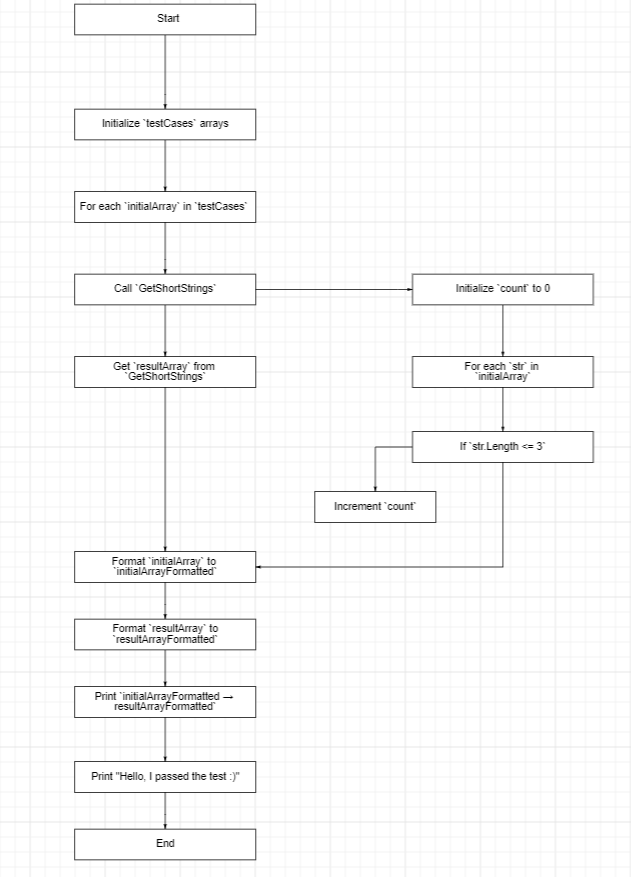

# String Filter Application

Этот проект написан на языке программирования C# и выполняет задачу фильтрации строк в массиве. Программа выбирает строки длиной меньше или равной 3 символам из каждого тестового массива и выводит результат в консоль.

## Описание

Программа принимает несколько массивов строк и для каждого из них выполняет следующие действия:
1. Ищет все строки длиной меньше или равной 3 символам.
2. Формирует новый массив из найденных строк.
3. Выводит исходный и результирующий массивы в формате `[исходный массив] → [результирующий массив]`.
4. После обработки всех массивов выводит сообщение: "Hello, I passed the test :)".

## Блок Схема




## Примеры

Вот как программа обрабатывает различные массивы:

- `["Hello", "2", "world", ":-)"]` → `["2", ":-)"]`
- `["1234", "1567", "-2", "computer science"]` → `["-2"]`
- `["Russia", "Denmark", "Kazan"]` → `[]`

## Использование

### Требования

- Установленный .NET SDK

### Компиляция и запуск

1. Склонируйте репозиторий или скопируйте файлы проекта.
2. Откройте терминал и перейдите в директорию проекта.
3. Компилируйте и запустите проект следующей командой:

    ```sh
    dotnet run
    ```

### Структура проекта

Проект состоит из одного файла:

- `Program.cs`: основной файл, содержащий код программы.

### Код программы

```csharp
using System;

class Program
{
    static void Main()
    {
        // Примеры массивов строк
        string[][] testCases = {
            new string[] { "Hello", "2", "world", ":-)" },
            new string[] { "1234", "1567", "-2", "computer science" },
            new string[] { "Russia", "Denmark", "Kazan" }
        };

        foreach (var initialArray in testCases)
        {
            // Вызов метода для получения нового массива с элементами длиной <= 3 символа
            string[] resultArray = GetShortStrings(initialArray);

            // Форматирование исходного массива
            string initialArrayFormatted = "[" + string.Join(", ", initialArray) + "]";
            // Форматирование результирующего массива
            string resultArrayFormatted = "[" + string.join(", ", resultArray) + "]";

            // Вывод результата в требуемом формате
            Console.WriteLine($"{initialArrayFormatted} → {resultArrayFormatted}");
        }

        // Вывод дополнительного сообщения
        Console.WriteLine("Hello, I passed the test :)");
    }

    static string[] GetShortStrings(string[] inputArray)
    {
        // Определение количества строк, длина которых <= 3
        int count = 0;
        foreach (string str in inputArray)
        {
            if (str.Length <= 3)
            {
                count++;
            }
        }

        // Создание нового массива нужного размера
        string[] resultArray = new string[count];

        // Заполнение нового массива
        int index = 0;
        foreach (string str in inputArray)
        {
            if (str.Length <= 3)
            {
                resultArray[index] = str;
                index++;
            }
        }

        return resultArray;
    }
}
